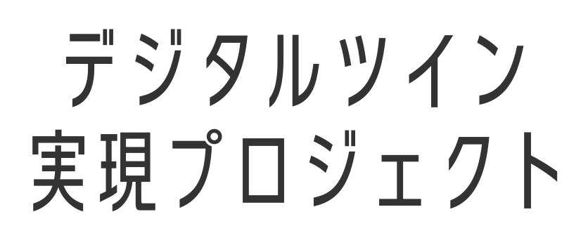

# Terria Map

 
こちらは、東京都デジタルツイン実現プロジェクトにおける「東京都デジタルツイン3Dビューア（β版）」で実現した機能を含む、TerriaMapのパッケージです。TerriaMapは、TerriaJSライブラリを用いたWebシステム（地図アプリケーション）です。
 
 

### 東京都デジタルツイン実現プロジェクト

- 情報発信サイト 
  https://info.tokyo-digitaltwin.metro.tokyo.lg.jp/  
- 東京都デジタルツイン 3D ビューア（β 版） 
  ※ 上記の情報発信サイトからリンクされております。 
  https://3dview.tokyo-digitaltwin.metro.tokyo.lg.jp/  
- [TerriaJs の公式ドキュメント](https://docs.terria.io/guide/)にはない東京都デジタルツイン 3D ビューア（β 版）独自の設定項目については、[こちら](https://github.com/tokyo-digitaltwin/terriajs/blob/tokyo_digitaltwin/CUSTOM_FEATURES.md)を参照ください。
